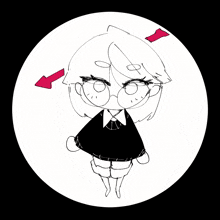

# Welcome to My Digital Universe! 

---

### About Me

<table align="center">
<tr>

<td width="50%" valign="top">

 

#### Who Am I?
- Name: `Javez Isaq B. Ferrer`
- Role: `Full-stack Dev`
- Pronounse: `He/him`
- Focus: `Passionate about good sleep, and no conflict merges.`

#### Quick Facts
- **Fun Fact:** `I can yap about stuff for hours on end`
- **Hobbies:** `Creating Mechanical Keyboards, Building PCs, Photo/videography, Basketball and Table Tennis`
- **Currently Reading:** `Ctrl + Alt + Resign`
- **Coding Playlist:** `Jpop/Jrock Enjoyer (Go listen to Zutomayo and ONE OK ROCK)`
- **Fuel of Choice:** `Coffee Addict and Lipovitan Enjoyer`

</td>

<td width="50%" valign="top">

**Current Focus:**
- Working on: `AI Powered Legal Documents Assistant`
- Learning: `Currently improving on C# and Java`
- Looking to collaborate on: `Looking for internship actually`
- Exploring: `AI, and fun APIs`

#### My Philosophy

> `"The past makes you wanna die out of regret and future makes you depressed out of anxiety. So by elimination, the present is likely the happiest time."`
> 
> `"A blade untouched by flame can never match the strength of one forged in fire."`

  
</td>

</tr>
</table>

  

### My Tech Toolbox

---

### Some Pictures from Photography

<table>
<tr>
<td width="50%">

</td>
<td width="50%">

</td>
</tr>
<tr>
<td width="50%">

</td>
<td width="50%">

</td>
</tr>
</table>

---

### Contribution Streak

---

### GitHub Trophies

---

### Activity Graph

---

### When I'm Not Coding

Jamming to music | Gaming | Reading tech blogs | Coffee enthusiast | Night owl developer

---

### Random Dev Quote

---

### Watch My Contribution Graph Get Eaten!

<picture>
  <source media="(prefers-color-scheme: dark)" srcset="https://raw.githubusercontent.com/laffeyy0629/laffeyy0629/output/github-contribution-grid-snake-dark.svg">
  <source media="(prefers-color-scheme: light)" srcset="https://raw.githubusercontent.com/laffeyy0629/laffeyy0629/output/github-contribution-grid-snake.svg">
  
</picture>

---

### Let's Connect!

---

### Support My Work

If you like what I do, consider buying me a coffee! ☕

---

### From [laffeyy0629](https://github.com/laffeyy0629) with 💜

